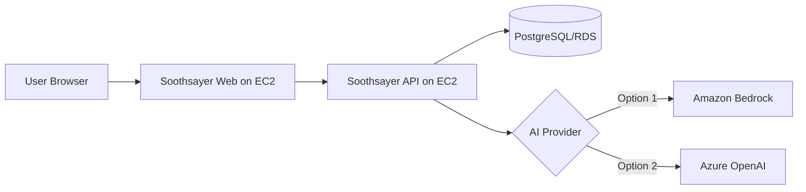

# My Verdict: AWS Bedrock vs Azure OpenAI for Soothsayer

Date context: February 12, 2026

This document summarizes what happened during setup, what worked, what failed, and what to use for stable demos.

## Executive Verdict

If your goal is a reliable demo today:

- Use AWS for hosting (`EC2 + app`)
- Use Azure OpenAI for model inference

If your goal is all-in AWS:

- Bedrock can work, but account-level quota/trust controls are the key risk for new accounts.

## What We Observed

### AWS Bedrock path

- IAM role was correctly attached.
- Inference profile IDs were required for some models.
- On-demand path hit token/day and throttling limits.
- Quota increase path was slow and sometimes blocked by account trust tier.
- Provisioned Throughput purchase attempt returned authorization block (support approval required).

### Azure OpenAI path

- Model deployment (`gpt-4o`) existed and was usable.
- Main failure was endpoint/key mismatch across resources.
- Once endpoint + key came from same resource and app used OpenAI-compatible path, integration became straightforward.

## Practical Architecture Comparison

Analogy:

- Soothsayer API is your dispatcher.
- Bedrock/Azure is your call center.
- Most reliability pain came from call-center access policy, not from dispatcher logic.

## Side-by-Side Table

| Parameter | AWS Bedrock (Observed) | Azure OpenAI (Observed) | Practical Note |
|---|---|---|---|
| Initial setup speed | Medium | Fast | Azure path moved faster after correct endpoint/key pairing |
| Auth model | IAM role + service quotas | API key + endpoint | Both secure; Bedrock needs more account-level enablement |
| Common failure | Throttling / tokens-per-day / entitlement | 401 key-endpoint mismatch | Bedrock failures were mostly quota-policy driven |
| Quota control | Strong, but stricter for new accounts | Typically simpler for existing Azure OpenAI setup | Existing enterprise setup matters |
| Cost predictability | Good with Provisioned Throughput | Good with deployment quota and token billing | Both are manageable with caps |
| Demo reliability for this project | Medium (blocked by quota) | High (after config fix) | Azure was better for immediate outcome |
| Operational complexity | Higher early-stage | Lower in this case | Azure won because deployment already existed |

## Cost and Effort Snapshot (Relative)

| Dimension | Bedrock On-Demand | Bedrock Provisioned | Azure OpenAI Deployment |
|---|---|---|---|
| Upfront effort | Medium | High | Low-Medium |
| Approval dependencies | Medium-High | High | Low-Medium |
| Burst handling | Variable by quota | Strong | Good if quota sized |
| Best use case | Flexible, lower steady load | Production with guaranteed throughput | Fast rollout with existing Azure estate |

## Challenges Faced (Real, Non-Generic)

1. Bedrock model ID confusion:
- base model ID vs inference profile ID/ARN mismatch.

2. Bedrock on-demand policy constraints:
- request accepted in config, then blocked by token/day or quota.

3. Provisioned Throughput authorization:
- blocked despite available credits due to entitlement controls.

4. Azure endpoint confusion:
- `services.ai.azure.com/models` vs OpenAI-compatible `cognitiveservices.azure.com/openai/v1`.

5. Key/endpoint mismatch:
- key from one resource and endpoint from another caused repeated 401.

6. Frontend cache/state confusion:
- persisted provider/model settings delayed visible config changes.

## Final Recommendation

For business demos and non-dev usability now:

1. Host app on AWS EC2 as-is.
2. Use Azure OpenAI as primary provider (`OPENAI_BASE_URL` + deployment model).
3. Keep Bedrock as secondary fallback path.
4. Revisit Bedrock primary only after quota/trust-tier and PT authorization are approved.

## Clear Next Step

Adopt this operating mode:

- `Primary`: OpenAI provider pointing to Azure endpoint
- `Model`: deployed `gpt-4o` (or `gpt-4o-mini` for lower cost)
- `Fallback`: Bedrock profile if/when quotas stabilize
