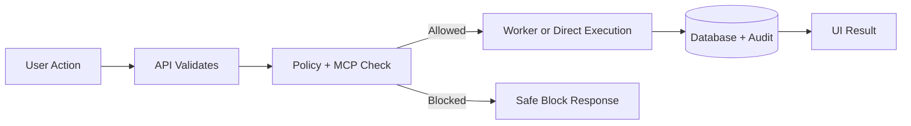

# Soothsayer System Explained (ELI12)

If this is your first time using Soothsayer, think of it like a smart company office:

- **Soothsayer UI** = your front desk and control panel.
- **API** = the receptionist that routes requests to the right team.
- **Worker** = the operations team handling long jobs in the background.
- **MCP kernel (`workspace-mcp`)** = the safety officer who checks rules before any risky action.
- **Database** = the permanent filing cabinet.
- **Redis** = sticky notes and quick queues for fast hand-offs.
- **Integrations (GitHub/Drive/etc.)** = secure visitor badges to other buildings.

## What happens when you ask Soothsayer to do something?

1. You type in Chat, Terminal, or Workflows.
2. The API receives your request and validates who you are.
3. If tools are needed, the API asks the MCP kernel.
4. The MCP kernel checks policy rules:
   - allowed paths
   - allowed tasks
   - risk level (`read`, `write`, `execute`)
5. If allowed, work runs immediately or gets queued for the Worker.
6. Results are saved and shown back in the UI.

## Why this matters

You get automation without chaos:

- It is **powerful** (can run useful actions),
- but also **governed** (can block unsafe actions),
- and **auditable** (you can trace what happened).

## Terms in plain language

- **Workflow**: A reusable checklist with steps.
- **Run**: One execution of that checklist.
- **Integration**: A secure connection to another app.
- **Policy**: House rules that decide what is allowed.
- **Approval gate**: “Ask a human before continuing.”

## What Soothsayer is not

- Not a magic black box.
- Not an unsafe auto-executor.
- Not a replacement for human judgment.

It is a guided automation system with guardrails.

## Quick mental model

If a normal app is a calculator, Soothsayer is an operations assistant:

- It can plan,
- act with rules,
- and report what it did.
