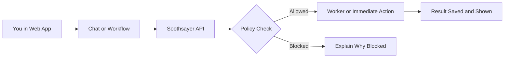
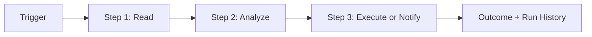
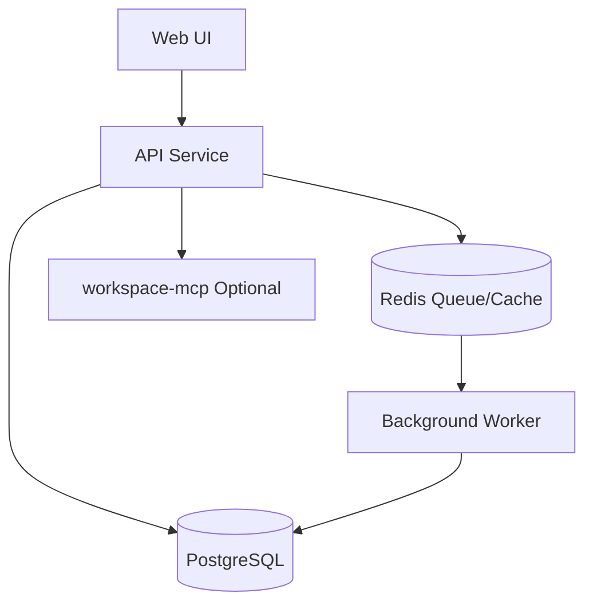

# Start Here (Non-Dev)

If you are new to Soothsayer, start with this page.

## Choose Your Path

- I want to use the app now: [NON_DEV_QUICKSTART.md](NON_DEV_QUICKSTART.md)
- I want to understand how it works: [NON_DEV_SYSTEM_EXPLAINED.md](NON_DEV_SYSTEM_EXPLAINED.md)
- I want to run workflows: [NON_DEV_WORKFLOWS_EXPLAINED.md](NON_DEV_WORKFLOWS_EXPLAINED.md)
- I want to connect external tools: [NON_DEV_INTEGRATIONS_EXPLAINED.md](NON_DEV_INTEGRATIONS_EXPLAINED.md)
- I am stuck and need fixes: [NON_DEV_TROUBLESHOOTING.md](NON_DEV_TROUBLESHOOTING.md)

## How Soothsayer Handles a Request

## Workflow Process at a Glance

## Architecture in Plain Language

## Important Release Note

`workspace-mcp` is maintained in this repository and should be used from source here unless official package coordinates are explicitly announced in release notes.
