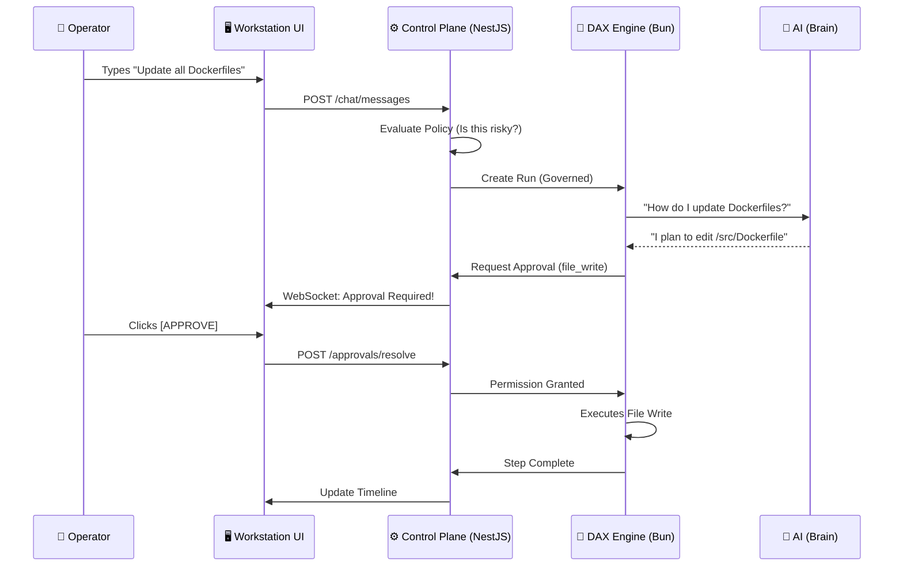

# Soothsayer: System & Orchestration Guide

Welcome to the **Soothsayer Operator Workstation**. This document explains how the system works in simple language for both developers and non-developers.

---

## 1. The Core Philosophy (The "3-Layer Cake")

To understand Soothsayer, imagine a three-layer system that separates **Thinking**, **Governing**, and **Acting**.

### Layer 1: The Brain (AI Providers)
*   **Who**: OpenAI (GPT-4), Google (Gemini), Amazon (Bedrock), or Local (Ollama).
*   **Role**: They process your text and plan what needs to happen. They don't "do" anything; they only "think."

### Layer 2: The Shield & Brain (Control Plane - Soothsayer)
*   **Who**: The NestJS Backend + React UI.
*   **Role**: This is where **Governance** happens. It listens to the Brain's plan, checks it against your **Policies**, and asks for your **Approval** before letting the next layer act.

### Layer 3: The Body (DAX Execution Engine)
*   **Who**: The DAX Runtime (Bun).
*   **Role**: The "hands" of the system. It actually writes code, runs terminal commands, and creates files. It only moves when the Shield (Soothsayer) gives it the green light.

---

## 2. The Workflow: How an Instruction Becomes Action

When you type: *"Fix the bug in the login route"*...

1.  **Handoff**: Soothsayer's **Policy Engine** identifies this as an "Execution Task" (not just a chat). It creates a **DAX Run**.
2.  **Inference**: The Brain (AI) analyzes your codebase and creates a multi-step plan.
3.  **Governance Gate**: For every high-risk step (like `file_write` or `shell_execute`), the system pauses.
4.  **Operator Approval**: You see a notification in your **Approval Inbox**. You see exactly what code will change. You click **Approve**.
5.  **Execution**: DAX performs the action and reports back.
6.  **Audit**: Every single thought and action is saved forever in the **Audit & Intelligence** dashboard.

---

## 3. System Orchestration Diagram



---

## 4. Current Top Use Cases

### 🛠️ Autonomous Codebase Refactoring
Update hundreds of files simultaneously. Instead of manual search-and-replace, the AI understands the context and you simply approve the batch.

### 🔍 Repository Intelligence
Ask "Which services are using the old Auth library?" and get a visual report + a plan to migrate them.

### 🛡️ Guarded Bug Fixing
Hand off a Jira ticket or bug report. The system finds the bug, reproduces it with a test, and presents you with the fix. You remain the **Authority** at every step.

---

## 5. How to Launch (Deployment Personas)

### Method A: Local Developer (The Fast Way)
Best for testing features and local hacking.
```bash
./launch.sh
```
*Starts API (3000), Web (5173), and ensures DB is synced.*

### Method B: The Containerized Stack (Docker)
Best for a consistent environment that mimics production.
```bash
docker-compose up --build
```

### Method C: The Enterprise Node (Cloud/EC2)
Best for long-running workstations with PM2 persistence.
```bash
pm2 start infra/ec2/ecosystem.config.cjs
```

---

## 6. Integrations & Tool Stack

Soothsayer is designed to be the "glue" for your AI engineering tools:

*   **FastMCP**: The protocol we use to give the AI access to your repo. It creates a secure bridge between the AI and your files.
*   **SSE (Server-Sent Events) Proxy**: How we keep your terminal stream alive even if your internet blips.
*   **Prisma**: The bridge to our **Execution Database**, where every action is audited.
*   **Socket.IO**: The real-time pulse that tells your UI when an approval is waiting.

---

*Document Version: 1.1.0*
*Hardened for Operator Plane v2*
